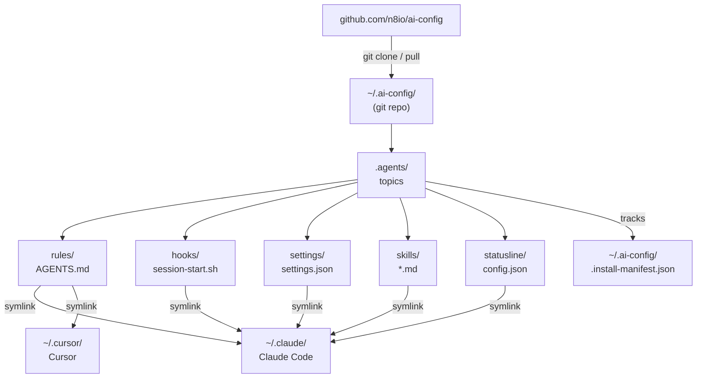

# 🤖 ai-config

> Provider-agnostic AI coding assistant config — shared rules, hooks, settings, and skills distributed via symlinks.

## ✨ What it does

Symlinks files from a shared git repo (`~/.ai-config`) into AI tool config directories. One repo, all your tools stay in sync.

**Supported providers:** Claude Code · Cursor

**Topics:**
| Topic | What it installs |
|---|---|
| `rules` | Shared `AGENTS.md` coding conventions |
| `hooks` | Prompt injection guard + session-start auto-sync |
| `settings` | Claude Code settings baseline |
| `skills` | Shared slash commands (`/commit`, etc.) |
| `statusline` | Custom status line display |

## 🚀 Quick start

```bash
npx @n8io/ai-config setup
```

That's it. The wizard clones the repo, detects your AI tools, and links everything.

## 📦 Commands

```
ai-config setup       # Guided onboarding (new team members start here)
ai-config install     # Install specific topics or providers
ai-config update      # Pull latest and re-apply symlinks
ai-config status      # Show symlink health
ai-config list        # List available topics
ai-config uninstall   # Remove installed symlinks
```

### `setup`
Interactive wizard — detects installed AI tools, lets you pick topics, previews changes, then applies.
```bash
ai-config setup
ai-config setup --provider claude   # skip provider detection
```

### `install`
Non-interactive install, good for scripts.
```bash
ai-config install                   # all topics, detected providers
ai-config install rules hooks       # specific topics only
ai-config install --provider claude # specific provider
ai-config install --yes             # skip conflict prompts
ai-config install --dry-run         # preview without applying
```

### `status`
Shows every installed symlink and its health. Exits 1 if anything is broken.
```
  Provider    Topic       File                              State
  ─────────   ─────────   ───────────────────────────────   ──────────
  claude      rules       ~/.claude/AGENTS.md               ✓ linked
  claude      hooks       ~/.claude/hooks/session-start.sh  ✓ linked

  Last synced: 3/14/2026, 8:42:00 AM

  Not installed: skills, statusline
```

### `uninstall`
```bash
ai-config uninstall              # remove all
ai-config uninstall rules hooks  # specific topics
ai-config uninstall --yes        # skip prompts (backups kept, not restored)
```

## 🔧 How it works



An **install manifest** (`~/.ai-config/.install-manifest.json`) tracks every symlink so `update` and `uninstall` know what's managed.

## 🛠️ Local development

```bash
git clone https://github.com/n8io/ai-config
cd ai-config
bun install
bun run cli setup     # runs against this repo dir (local dev mode)
bun test
```

**Local dev mode** is auto-detected when running from the cloned repo — no `~/.ai-config` needed.
